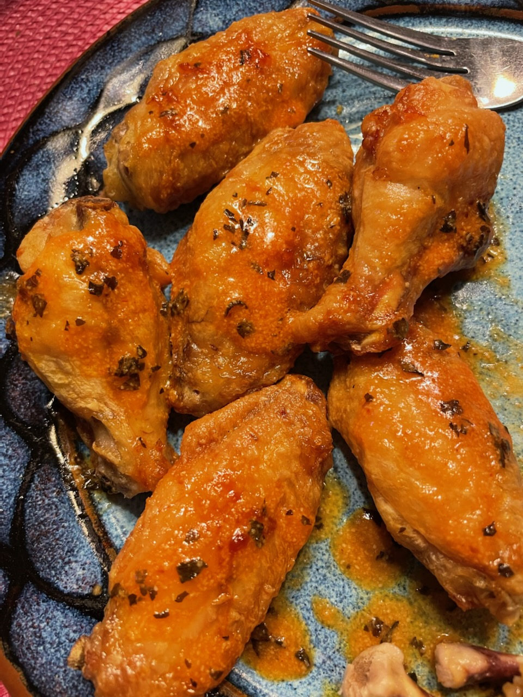

# Oven "Fried" Frozen Buffalo Wings ([source](https://www.seriouseats.com/the-best-buffalo-wings-oven-fried-wings-recipe))

This recipe uses Serious Eats's process for treating and dry aging wings to increase surface area and decrease moisture so the outside crisps up in the oven almost like fried wings.

On top of that, I do a whole bunch at once and give them the same treatment as the [frozen buttermilk biscuits](../breakfast/ac-frozen-buttermilk-biscuits.md), freezing them and taking them out a serving at a time to make them.

## Ingredients

### Wings

This scales easily, depending on how much chicken you get; just up the ingredients to match the number of pounds of chicken you're preparing.

* 1lb chicken drumettes and flats
* 1tsp baking powder
* 1tsp kosher salt

### Sauce

* 2tbsp unsalted butter
* 2tbsp Frank's RedHot or Texas Pete
* ???
* Profit

## Preparing the Wings

Line a rimmed baking sheet with aluminum foil and set a wire rack inside.
Carefully dry the chicken wings with paper towels.
In a large bowl, combine wings with baking powder and salt and toss until thoroughly and evenly coated.
Place on rack, leaving a slight space between each wing.

Place baking sheet with wings in refrigerator and allow to rest, uncovered, at least 8 hours and up to 24 hours.

Move them to the freezer for at least 4 hours, and then store them in a ziplock bag.

## Baking

I suspect how these bake will depend _very_ much on your oven, and whether you use convection.
Since they start frozen, the goal is to begin low to thaw them and cook them, and then bring the heat up at the end to get them to maximum crispiness while retaining moisture on the inside.

I use convection, but the general rule of thumb here should work without it, just bump the temperatures up by 25 degrees or so.

1. Line a baking sheet with foil and put a wire rack inside, just like when you froze them, and place your wings on top.
   Astute readers will notice that I converted the recipe from straight baking to freezing.
   You should be able to bake these right after refrigeration, you will just likely need to adjust the times.
2. Adjust the rack to the upper-center, and heat the oven to 350°F convection, then add the baking sheet of wings.
3. Bake for 20 minutes, then flip.
4. Bake for 15 more minutes, then flip again.
   After the 2nd flip, bump the oven up to 425°F convection.
5. Bake for 5-15 more minutes, flipping regularly, until golden brown.
   Ideally, an instant-read thermometer should measure the meat at 165°F.

You will probably want to experiment to find the right numbers to maximize internal juiciness and external crispiness, while still reaching a safe temperature for eating.

## Preparing the Sauce

While the wings are baking, make the sauce.

Ideally, you will combine the sauce ingredients on the stovetop and cook over medium heat, whisking regularly, until the sauce is warm and you get the perfect consistency... but c'mon, who does that?
Get a whole pan dirty for _this?_
Do you think I'm _made_ of pans?

Anyway, I just stick them in a ramekin and microwave in 20-30 second increments until the butter is melted, and then whisk them together with a fork.

This basic combination of butter + hot sauce is _super_ easy to augment with almost anything, so go wild.
The butter tempers the hot sauce enough that it gets a little kick, but isn't crazy spicy.

I've added garlic powder, dried herbs like oregano or basil, or even [Japanese BBQ Sauce](https://bachans.com/products/the-original-japanese-barbecue-sauce?variant=35908356604071) for a nice salty/sweet teriyaki flavor.

## Combine and Serve

When the wings are done baking, put them in a large bowl, add the sauce, and toss them to coat.
Or, if you're lazy like me, just pour it over the wings once you put them on your plate and drag them around a bit in the sauce until they're covered.
No one has to know.

Serve immediately with blue cheese dressing and celery sticks.
